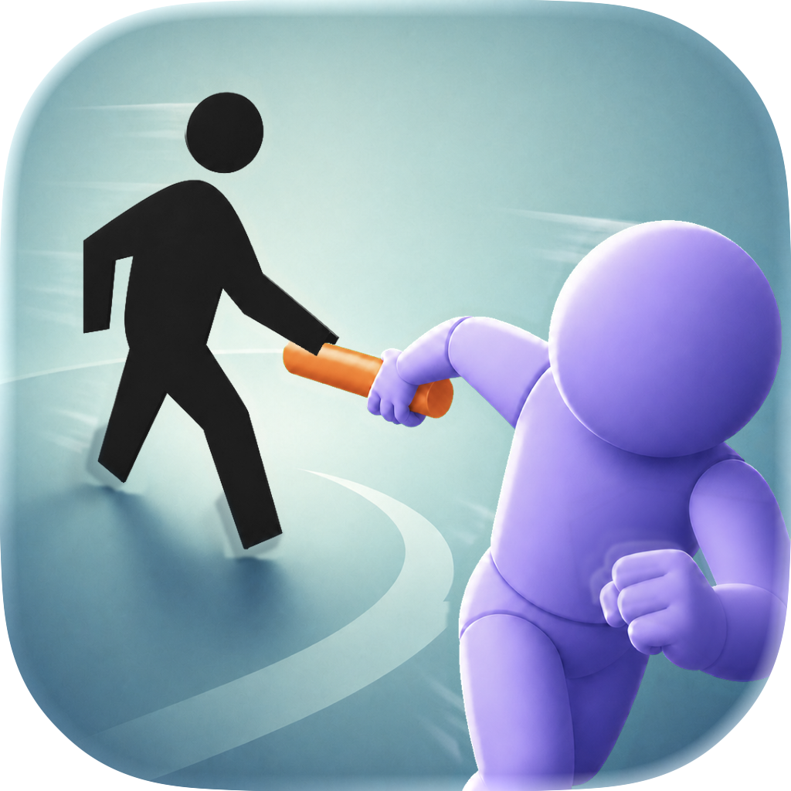

<p align="center">
  
</p>

<h1 align="center">AFK Relay</h1>

AFK Relay is a native iOS survival game where real-world walking becomes tactical
movement. Every eligible HealthKit step mints one movement token. In the arena,
the player has no attack: survival depends on positioning enemies so their
telegraphed attacks hit one another.

> **Status:** Gameplay-proof MVP implemented for signed-device and TestFlight
> validation. The remaining gates are physical-device HealthKit checks,
> oldest-device performance profiling, moderated playtesting, signing, and
> App Store Connect distribution.

## MVP

- Native iPhone app built with SwiftUI, SpriteKit, and HealthKit.
- One credited real-world step creates exactly one movement token.
- Continuous joystick movement is the only use of movement tokens.
- The player has no attack, building action, spell, or defense.
- Analytic enemy sweeps use universal friendly fire and never damage their source.
- State remains on device; the MVP has no account or custom backend.
- Diagnostic primitive graphics and the optional inspection overlay are intentional.

## Implemented gameplay proof

- HealthKit cumulative-step aggregation from a fixed first-connection boundary.
- Atomic current/previous economy generations with exact-once high-water credit.
- Immediate in-memory movement spending, fractional carry, scheduled checkpoints,
  lifecycle flush, and fail-closed retry.
- A framework-free deterministic `1/60s` arena with swept-circle sliding,
  solid kinematic bodies, telegraph/active/recovery sweeps, source immunity,
  multi-target friendly fire, endless spawning, death, and run records.
- Deterministic discovery staging: evade one attack, observe enemy damage, then
  enter endless pressure.
- SwiftUI onboarding, wallet, HUD, joystick, pause/settings, recovery, and run
  summary surfaces.
- SpriteKit diagnostic primitives, exact attack geometry, non-color cues,
  friendly-fire impacts, and a toggleable inspection overlay.
- Swift Testing coverage for economy, persistence, geometry, simulation,
  refresh coalescing, architecture boundaries, and catalog substitution;
  XCTest covers the deterministic end-to-end UI flow.

## Requirements

- macOS with an iOS 26-capable Xcode release.
- An iOS simulator for deterministic development and UI automation.
- A signed physical iPhone and Apple Developer configuration for HealthKit
  integration and device acceptance checks.

The app target is iOS 26+, iPhone-only, and portrait-only. All targets use
Swift 6 with complete concurrency checking and Main Actor default isolation.

## Open and run

1. Open `AFKRelay.xcodeproj` in Xcode.
2. Select the `AFKRelay` scheme.
3. Choose an iPhone simulator.
4. Run with **Product → Run** (`⌘R`).

Run the test suite with **Product → Test** (`⌘U`). Two test plans organize
verification:

- **AFKRelay-Full** (default): every unit, architecture, launch, and UI
  scenario test. Intended for the simulator, where the architecture checks
  can read the source tree.
- **AFKRelay-Device**: the unit suite plus the three ordered UI scenarios
  (seeded gameplay loop, live HealthKit onboarding, instrumented arena
  performance) without launch-screenshot or launch-time churn. Intended for
  signed physical devices, which must stay unlocked while UI tests run.

Command-line verification:

```sh
./scripts/check-architecture.sh

xcodebuild \
  -project AFKRelay.xcodeproj \
  -scheme AFKRelay \
  -testPlan AFKRelay-Full \
  -destination 'platform=iOS Simulator,name=iPhone 17 Pro' \
  test

xcodebuild \
  -project AFKRelay.xcodeproj \
  -scheme AFKRelay \
  -testPlan AFKRelay-Device \
  -destination 'platform=iOS,name=<your iPhone>' \
  test
```

HealthKit behavior must ultimately be verified on signed physical hardware; the
domain economy will use a fake health provider in deterministic tests.

## Repository layout

```text
AFKRelay/
  App/                 Composition root, coordinator, and application shell
  Domain/              Economy, geometry, and deterministic simulation
  Game/                Fixed-step SpriteKit presentation bridge
  Health/              Narrow HealthKit aggregate adapter and refresh service
  Persistence/         Atomic ledger and independent player progress
  Presentation/        Catalog roles, immutable render DTOs, and renderer
  UI/                  SwiftUI onboarding, HUD, controls, settings, and results
  AppIcon.icon/        Layered, appearance-aware production app icon
  Assets.xcassets/     Accent color and additional visual assets
AFKRelayTests/          Swift Testing unit and integration tests
AFKRelayUITests/        XCTest UI tests
AFKRelay.xcodeproj/     Xcode project
Brand/                  Theme-neutral icon sources and art provenance
scripts/                Static architecture verification
```

## Documentation

The canonical product and engineering specification lives in the companion
GitHub Wiki. In the paired local checkout, that repository is located at
`../wiki/`.

Coding agents must follow [AGENTS.md](AGENTS.md) before changing implementation
code. Proposals in the wiki describe possible future work and are not approved
MVP scope.

## Privacy

The MVP reads step count only. HealthKit framework values stop at the health
adapter boundary, health-derived measurements are not used for advertising or
marketing, and the game does not require a custom network service.

## License

Copyright is reserved. No permission to reuse, modify, or distribute this
software is granted without prior written authorization. See [LICENSE](LICENSE).
